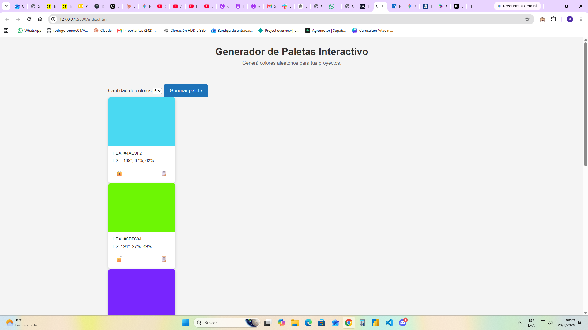

# 🎨 Generador de Paletas de Colores

Aplicación web desarrollada como MVP para generar paletas de colores aleatorias de forma rápida e intuitiva.

El proyecto fue realizado utilizando HTML, CSS y JavaScript puro, aplicando manipulación del DOM, eventos, almacenamiento local y buenas prácticas básicas de desarrollo frontend.

---

## 🚀 Demo

🔗 GitHub Pages:

https://rodrigoromero01.github.io/ProyectoM1_RodrigoRomero/

---

## 📸 Captura de pantalla



---

## ✨ Funcionalidades

- Generación de paletas de 6, 8 o 9 colores.
- Colores mostrados en formato HSL y HEX.
- Copiar el código HEX al portapapeles.
- Bloqueo y desbloqueo de colores individuales.
- Guardado automático de la última paleta mediante LocalStorage.
- Microfeedback mediante Toast.
- Animaciones sutiles al generar nuevas tarjetas.
- Diseño orientado a escritorio.

---

## 🛠️ Tecnologías utilizadas

- HTML5
- CSS3
- JavaScript (ES6)
- Git
- GitHub
- GitHub Pages

---

## 📂 Estructura del proyecto

```
📁 HENRY-POJECT-M1
│
├── index.html
├── script.js
├── README.md
│
└── css
│    └── styles.css
└── assets
│    └── screenshot.png
└── docs
    └── ia-consulta-01.jpg
    └── ia-consulta-02.jpg
    └── ia-consulta-03.jpg
    └── ia-consulta-04.jpg
    └── ia-consulta-05.jpg
    └── ia-consulta-06.jpg
    └── ia-consulta-07.jpg
    └── ia-consulta-08.jpg
    └── ia-consulta-09.jpg
```

---

## ▶️ Cómo ejecutar el proyecto

1. Clonar el repositorio.

```
git clone https://github.com/rodrigoromero01/ProyectoM1_RodrigoRomero
```

2. Abrir el archivo `index.html` en el navegador.

O acceder directamente desde GitHub Pages.

---

## 📚 Conceptos aplicados

Durante el desarrollo se trabajó con:

- Manipulación del DOM.
- Eventos.
- Funciones.
- Arrays y objetos.
- LocalStorage.
- JSON.stringify() y JSON.parse().
- Clipboard API.
- Animaciones con CSS.
- HTML semántico.
- Accesibilidad básica.

---

## 🤖 Uso de Inteligencia Artificial

Durante el desarrollo de este proyecto utilicé herramientas de Inteligencia Artificial como apoyo para comprender conceptos y mejorar el proceso de aprendizaje

### ¿En qué la utilicé?

- Resolver dudas sobre JavaScript y manipulación del DOM.
- Comprender el funcionamiento de eventos, funciones y renderizado dinámico.
- Obtener ejemplos para implementar funcionalidades como:
    - Generación aleatoria de colores.
    - Conversión de HSL a HEX.
    - Copiado del código HEX al portapapeles.
    - Bloqueo de colores.
    - Uso de localStorage.
- Recibir sugerencias para mejorar la estructura del código HTML y CSS.
- Ayuda para la depuración de errores mostrados en la consola del navegador.
- Asistencia en la redacción del README y documentación del proyecto.

### ¿Qué aprendí?

El uso de IA me permitió comprender mejor conceptos que inicialmente no dominaba, especialmente en JavaScript. En lugar de copiar código sin analizarlo, fui probando cada solución, adaptándola al proyecto y entendiendo cómo funcionaba antes de incorporarla.

Entre los temas que reforcé se encuentran:
- Manipulación del DOM.
- Eventos y listeners.
- Creación dinámica de elementos HTML.
- Uso de arrays y objetos.
- localStorage.
- Manejo del portapapeles (navigator.clipboard).
- Organización del código en funciones reutilizables.
- Uso de Git y GitHub durante el desarrollo.

### Reflexión 

La Inteligencia Artificial fue utilizada como una herramienta de apoyo al aprendizaje y a la resolución de problemas, similar a consultar documentación técnica o foros especializados. Todas las funcionalidades fueron integradas, adaptadas y verificadas durante el desarrollo del proyecto.

### 📸 Evidencias del proceso

Como parte del proceso de desarrollo se incluyen capturas de pantalla en la carpeta /docs, donde se observa el uso de herramientas de IA para resolver dudas, comprender conceptos, solicitar ayuda y mejorar la implementación del proyecto.


**Cada sugerencia proporcionada por la IA fue analizada, adaptada y probada antes de incorporarla al proyecto. El objetivo principal fue utilizar la herramienta como apoyo para el aprendizaje y no como un reemplazo del proceso de desarrollo.**

---

## 👨‍💻 Autor


Rodrigo Romero.-